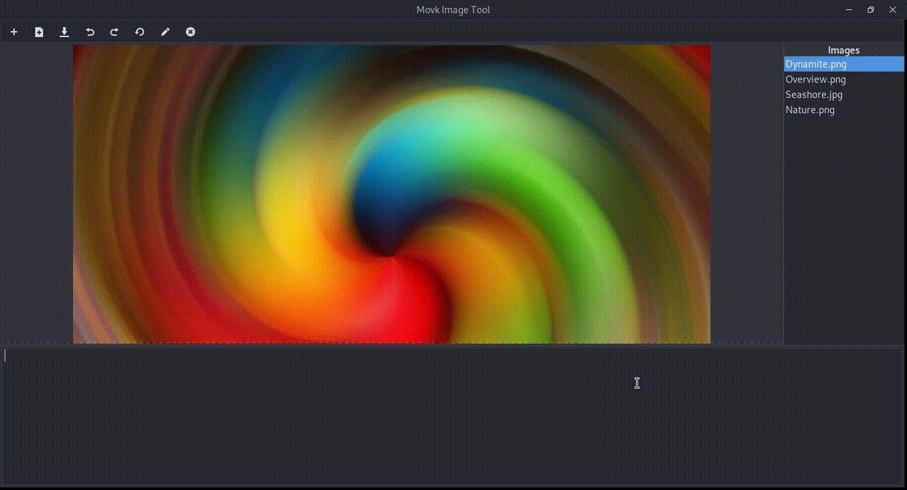
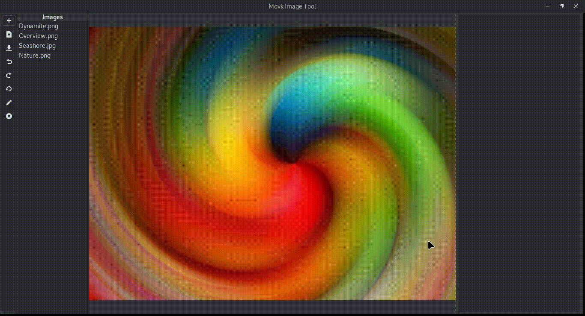

Aduct is a toolkit to design graphical applications that can be
dynamically changed with a little work as possible. It is designed by
inheriting objects provided by `Gtk <http://www.gtk.org>`__ and thus by
following principles of Aduct with Gtk, one can make powerful
applications that are easy for a developer to develop, third-party
person to improve and end user to use.

**What You Made**

|what_you_made|

**What Users Want**

|what_users_want|

**What Aduct Does**

|what_aduct_does|

Version
-------
The latest version of Aduct is 1.1.0

License
-------
Aduct is published under `GNU Lesser General Public License
<https://www.gnu.org/licenses/lgpl-3.0.html>`__ . You are free to use Aduct in your 
commercial applications without any restriction.

Installation
------------
Aduct requires Gtk. So install it first if not already done. Then grab the latest version of Aduct
using PIP:

.. code:: bash

   $ pip install aduct

Getting Started
---------------
Learn to make the best use of Aduct with the `docs <https://aduct.readthedocs.io/>`__.

Contribution
------------
Contributing is easy! A few ways of doing so are given below:
 1. Use Aduct and report us the bugs you encounter.
 2. Request new features.
 3. Improve documentation, add new articles, write better examples.
 4. Spend time with the source code and make it perfect.

.. |what_aduct_does| image:: docs/demo_reel/what_aduct_does.gif
