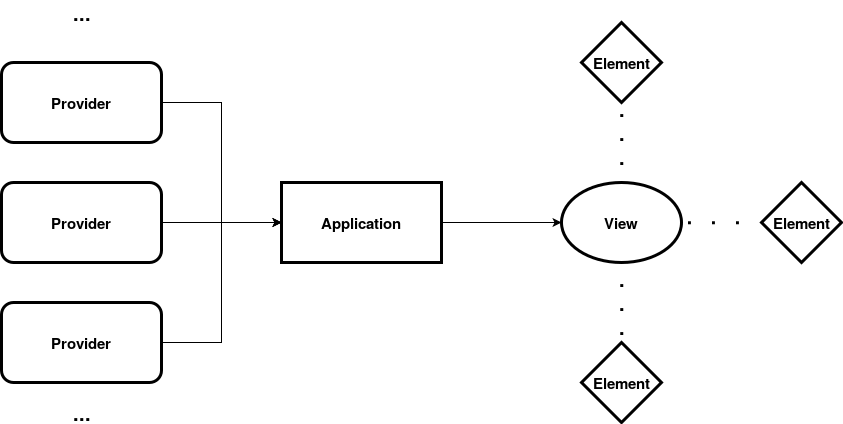
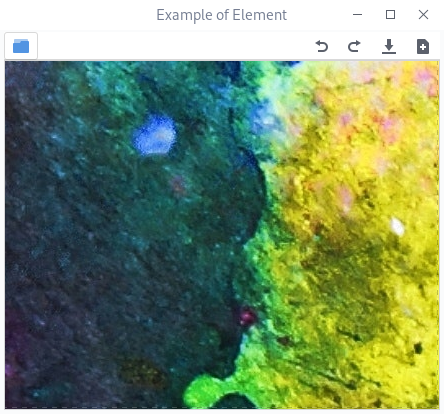

Overview
========

Let us now learn how to design a flexible interface using Aduct. It
isn’t any difficult, so let’s get started. An interface designed with
Aduct is backed up by three things; providers, views and elements. The
following sections describe them in an elaborate manner.

|overview|

Aduct.Provider
--------------

Provider is an object that can produce widgets. They can be taken as a
factory that can assemble and give you widgets when required. The
provider owns every information about the widget it produces, so it can
easily produce duplicate widgets and also control them as required.
Apart from assembling widgets, they can also dissemble a widget when
required. A dissembling process ideally extracts information from a
widget and then destroys it.

Widgets can however be stored (in memory), if making a widget is so
tedious compared to storing them. So, you can also reuse a widget and
make a new one only when you run *out of stock*. The process of
dissembling a widget is called *clearing*. A widget produced by a
provider is known as child. In fact, the word *widget* is rarely used
and instead the term *child* is used.

Aduct.Element
-------------

|sample_element|

Element is an container that can hold the child produced by a provider.
They are the front-end in an application, so any sort of interaction
happens via elements. An element has an action button. It is used to
alter the child in the element, like changing, removing, clearing a
child. Action buttons are recommended, but can be avoided if you have
any other approach. On the side of an action button, you can also add widgets
like quick tool buttons. Ideally you can attach only one widget, so if
you want to add multiple widgets, put them inside a container like grid
or box. Elements can not be directly attached to an interface, they need
a container called views.

Aduct.View
----------

View is a container of widgets. Aduct comes with three basic views,
that are enough for most of the use cases. New views can also be made
easily if they don’t satisfy your need. The three views are :

Aduct.Bin
~~~~~~~~~

A bin can contain only one child. The child can either be another view
or element.

Aduct.Paned
~~~~~~~~~~~

A paned is a container that can hold two children, either in vertical or
horizontal direction. Similar to a bin, paned can hold either a view or
an element. Paned contains a movable handle between its children, which
can change the *space* allocated to each child.

Aduct.Notebook
~~~~~~~~~~~~~~

A notebook can contain an arbitrary number of children, but they all
should be elements. In a notebook, only one child is visible at a time
and the visible child can be changed using the tabs located on an edge.
Notebook also has action buttons, attached at either side of tabs or at
one side. They are optional, so can be avoided if not needed.

Framing an Application
----------------------

Now we describe how to create a convenient interface using Aduct.

-  Make all the basic things required to make the application, like
   collecting plugins, user data.

-  From your plugins and own collection, make a list of providers which
   can produce child widgets.

-  Design an interface that you and a lot of users find convenient. The
   interface designed should be using views and elements, with children
   from providers.

-  Then connect the elements, views with *tweak* functions. Tweak
   functions are those that can modify properties of views and elements.

-  Provide a way for the users to save and load interfaces using
   Aduct’s built-in functions.

The above points do not explain how they are done practically, so let’s
get our hands wet in a short tutorial in next chapter.

